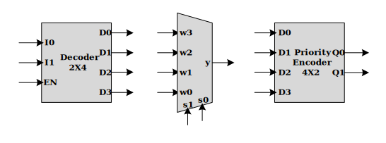

# CE202-LC-Lab-Material

## Logic Circuits Lab 05

### Goals

- How describle Encoder, Decoder, Multiplexer?
- Structural implementation in Verilog
- How write Testbench?
- Implementing parity bit generator 

### Pre-Report
* Write verilog code for decoder 2x4, encoder 4x2 and multiplexer 4x1 in gate level.

**Note**
* [1]. for design in gate level you can use `and, nand, or, nor, xor, xnor, not` **primitives** (i.e. `not g_not(a, b)`).
* [2]. for design in gate level you can use **assign** keyword (i.e `assign a = ~b`).

### Grading Sources

* Write verilog code for encoder, decoder, and multiplexer of pre-report section (***decoder2x4.v, encoder4x2.v, and multiplexer4x1.v***).

* Simulate encoder, decoder, and multiplexer verilog files in ISim. You can use included testbench files.

* Design 4 to 16 Decoder using 2 to 4 Decoder and write verilog code of it (***decoder4x16.v***).

* complete  testbench file that design for validate the correctness of modules (***tb_paritiy3_gen.v***).

* Design prime number detector by implementing **f(a,b,c,d) = &#928;(0,1,4,6,8,9,10,12,14,15)** using decoder 4x16 (***function4x1.v***).

### Submission Sources
* Source files (Grading Sources)
* Waveform of testbeches that covers all signals in `testbench.png` diagram