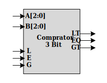

# CE202-LC-Lab-Material

## Logic Circuits Lab 06

### Goals

- How describle comparator in gate level?
- Structural implementation in Verilog

### Pre-Report
* Write verilog code for 3 bits comparator in gate level.

### Grading Sources

* Write verilog code for 3 bits comparator of pre-report section (***comparator3.v***).

* Simulate 3 bits comparator in Xilinx ISim. You can use included testbench files.

* Synthesis 3 Bit Comparator without any error and warning.

* Save RTL Schematic of 3 bit comparator as a file.

* Design 8 bits comparator using 3 bits comparator and write verilog code of it (***comparator8.v***).

* Complete testbench file of 8 bit comparator for validate the correctness of modules (***tb_comparator8.v***).

* Synthesis 8 Bit comparator and report reason of any warning.

### Submission Sources
* Source files (Grading Sources)
* Waveform of testbeches that covers all signals in `testbench.png` diagram
